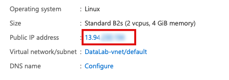

## Connect to your VM

If you have configured you VM correctly, you should connect via
SSH with your SSH key. 

- First you have to find the IP address of you VM. 

- Go to the Azure portal and search for your VM (click virtual machines on the top)
and choose your VM

- If it has not been started yet, click ``Start``

- On the top right you should see the IP address of you VM


- Note it down, you need it later. 
- Go to a new terminal window (CMD on Windows)
- type in 
    ```
  ssh ubuntu@<vm-ip-address>
  ```

You shoud now be connected to you Ubuntu VM. 