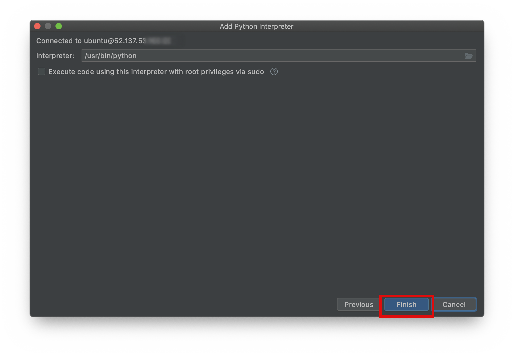

## Setup PyCharm for working with a VM

First of all make sure, that you have PyCharm professional. You can download
a free trial version [here](https://www.jetbrains.com/de-de/pycharm/download/). If
you are a student and you have an official university email address you can get
the professional version for free [here](https://www.jetbrains.com/community/education/#students).
Note that the community version is not enough, since it doesn't allow you to connect with a
remote host.

Create a new PyCharm Project

1. Select a location on your local machine where to store your project.
1. Click the three-dot icon to choose an interpreter.
    
1. Enter the host ip address.
1. Enter the username of your VM (by default ubuntu).
1. Click Next
    
1. Click the folder icon to choose your Python interpreter.
    
1. Choose your Python interpreter. If you use anaconda it is in your
anaconda folder: `/anaconda/envs/<name-of-your-env>/bin/python` or 
`/home/<username>/anaconda/envs/<name-of-your-env>/bin/python`.
1. Click OK.
    
1. Click Finish.
    
1. Choose the location on the host where your PyCharm project folder
should be mirrored. E.g. create a folder pycharm in your user folder and 
then choose ```/home/ubuntu/pycharm/<your-project-name>```
1. Click Create.
    
